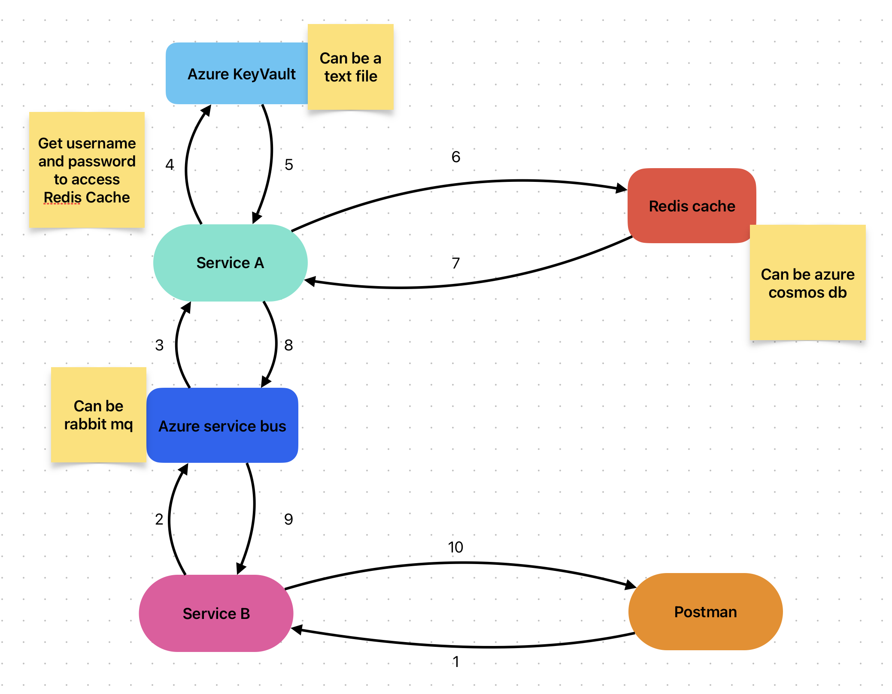

# Dapr Microservices Test

This is a test project as an overview of the Dapr integration into a microservices atchitecture.

## Technologies

The main tecnologies involved are:
- Terraform to deploy the cloud infrastructure on Azure
- .NET 7 for the backend services
- Dapr 

The goal is to develop an infrastrucure where Dapr helps for a quick switch between local environment and production environment.
The involved resources are:
- Message Broker
  - Azure Service Bus (Cloud Resource)
  - RabbitMQ (Local Resource)
- Secret Store
  - Azure Key Vault (Cloud Resource)
  - json text file (Local Resource)
- Database
  - Azure Cosmos Db (Cloud Resource)
  - Redis (Local Resource)

## Architecture Overivew

